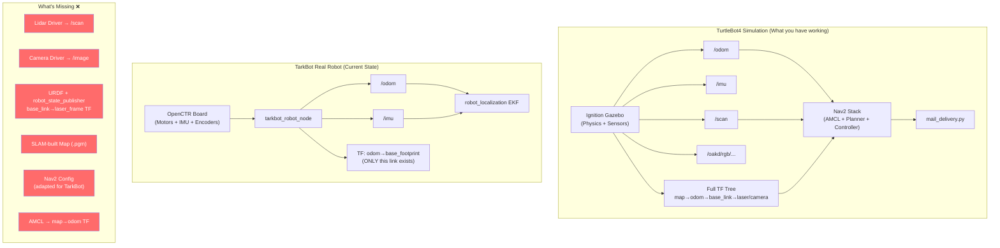

# TarkBot Real Robot vs TurtleBot4 Simulation — Gap Analysis

## Summary

Your TarkBot real robot base driver is **very well-built** and already covers the critical Low-Level tier. However, there are several missing pieces before you can run `mail_delivery.py` on the real robot. This document maps everything out.

---

## ✅ What's Already Done & Working

### 1. Base Driver Node (`robot_node.py`)
Your TarkBot driver node handles:
- Serial communication with the OpenCTR board at 50Hz
- Publishing `/odom` (nav_msgs/Odometry) with pose + twist + covariance
- Publishing `/imu` (sensor_msgs/Imu) with gyro, accel, and Mahony AHRS orientation
- Publishing TF: `odom` → `base_footprint`
- Subscribing to `/cmd_vel` (geometry_msgs/Twist) and forwarding to motors

> [!TIP]
> This is functionally identical to what the TurtleBot4's iRobot Create 3 base does internally. The ROS 2 interface contract is the same: `/odom` out, `/cmd_vel` in. **This is excellent.**

### 2. EKF Fusion (`ekf.yaml` + `robot_localization`)
Your EKF config fuses:
- **odom0** (wheel encoder twist: `vx`, `vy`, `wz`) — ✅
- **imu0** (gyroscope angular velocity Z only) — ✅
- Properly avoids fusing IMU yaw orientation (no magnetometer) — ✅
- Publishes `/odometry/filtered` and TF `odom` → `base_footprint` — ✅

### 3. Topic Names

| Interface | TarkBot (Real) | TurtleBot4 (Sim) | Compatible? |
|-----------|---------------|-------------------|-------------|
| Velocity command | `/cmd_vel` | `/cmd_vel` | ✅ Match |
| Odometry | `/odom` | `/odom` | ✅ Match |
| IMU | `/imu` | `/imu` | ✅ Match |
| EKF filtered odom | `/odometry/filtered` | (internal) | ✅ OK |

### 4. Frame Names

| Frame | TarkBot (Real) | TurtleBot4 (Sim) | Note |
|-------|---------------|-------------------|------|
| Odom frame | `odom` | `odom` | ✅ Match |
| Base frame | `base_footprint` | `base_link` | ⚠️ Different name — see below |
| IMU frame | `imu_link` | (internal) | ✅ OK |

---

## ❌ What's Missing — The Gap

### 1. URDF / TF Tree (CRITICAL)

> [!CAUTION]
> **This is the #1 blocker.** Without a proper URDF, Nav2 cannot function at all.

Your TarkBot currently only has one TF link: `odom` → `base_footprint`. 

The TB4 simulation has a **full TF tree** including:
```
map → odom → base_link → [laser_frame, oakd_link, ...]
```

**What you need to create:**
A lightweight `tarkbot.urdf` (or `.xacro`) that defines:
- `base_footprint` → `base_link` (ground plane to robot center, typically just Z offset)
- `base_link` → `laser_frame` (where Lidar is mounted relative to robot center)
- `base_link` → `camera_link` (where Camera is mounted, if using ArUco)
- `base_link` → `imu_link` (where IMU is mounted — you already have a static TF for this)

Without the `base_link` → `laser_frame` transform, **AMCL will compute completely wrong positions** because it won't know where the Lidar physically sits on your robot.

### 2. `base_footprint` vs `base_link` Mismatch

| Config file | Frame used | 
|-------------|-----------|
| TarkBot `robot.yaml` | `base_footprint` |
| TarkBot `ekf.yaml` | `base_footprint` |
| TB4 `nav2.yaml` | `base_link` |
| TB4 `localization.yaml` (AMCL) | `base_link` |

> [!IMPORTANT]
> When you create your Nav2 config for the real robot, you must choose ONE consistent base frame name. Either:
> - **Option A:** Keep `base_footprint` everywhere and change Nav2 configs to use `base_footprint`
> - **Option B:** Change TarkBot driver to output `base_link` and update EKF config
> 
> **Recommendation:** Keep `base_footprint` (it's a ROS convention for ground-projected frame), add a static TF `base_footprint` → `base_link` in your URDF, and set Nav2's `robot_base_frame: base_footprint`.

### 3. Lidar Driver Node (CRITICAL)

Your TarkBot package has **no Lidar node**. Nav2 absolutely requires a `/scan` topic (sensor_msgs/LaserScan) for:
- AMCL localization (matching scans to map)
- Costmap obstacle detection (real-time obstacle avoidance)

**Action:** You need to install and launch your Lidar manufacturer's ROS 2 driver. Common ones:
- RPLidar: `ros2 launch rplidar_ros rplidar_a2m8_launch.py`
- YDLidar: `ros2 launch ydlidar_ros2_driver ydlidar_launch.py`
- SICK: `ros2 launch sick_scan_xd sick_tim_5xx.launch.py`

The driver must publish to `/scan` topic.

### 4. Camera Driver Node (For ArUco)

If you want ArUco-based initialization on the real robot (like in simulation), you need a camera publishing to an image topic. Your `mail_delivery.py` currently subscribes to `/oakd/rgb/preview/image_raw`.

**Action:** Install and configure your camera's ROS 2 driver. The topic name in `mail_delivery.py` will need to be updated to match your real camera's topic.

### 5. Nav2 Configuration for Real Robot

You currently have **no Nav2 config files** in the `tarkbot_robot` package. You need copies of these adapted for your robot:

| TB4 Config File | Purpose | Needs Adaptation? |
|-----------------|---------|-------------------|
| `nav2.yaml` | Controller, Planner, Costmap, BT | Yes — `robot_radius`, velocities, `base_frame` |
| `localization.yaml` | AMCL params | Yes — `base_frame_id`, laser params |

Key parameters to change in your copy of `nav2.yaml`:
```yaml
# Change all instances of:
robot_base_frame: base_link
# To:
robot_base_frame: base_footprint

# Update to match your robot's physical size:
robot_radius: 0.???  # Measure your robot (meters)

# Update to match your motor capabilities:
max_vel_x: 0.???     # Test max speed of your robot
max_vel_theta: 0.??? # Test max rotation speed
acc_lim_x: 0.???     # Tune to avoid wheel slip
```

### 6. Map File (CRITICAL)

AMCL needs a pre-built map (`.yaml` + `.pgm` files) to localize against. You need to either:
- **Option A:** Drive the real robot around with Lidar + SLAM to build a map first
- **Option B:** If your real environment matches the simulation world, export the sim map

**Action:** Run SLAM Toolbox on the real robot first:
```bash
ros2 launch slam_toolbox online_async_launch.py
# Drive the robot around the environment
# Save the map:
ros2 run nav2_map_server map_saver_cli -f ~/maps/my_building
```

### 7. `use_sim_time` Flag

> [!WARNING]
> Every TB4 config file has `use_sim_time: True`. On the real robot, this **MUST** be `False` or your timestamps will be completely broken.

All your real-robot config files must set:
```yaml
use_sim_time: False
```

---

## 📋 Step-by-Step Action Plan

Here's the ordered checklist to go from your current state to a fully working Nav2 + mail_delivery system on the real TarkBot:

### Phase 1: Hardware Drivers
- [ ] **Install Lidar ROS 2 driver** — Get `/scan` topic publishing
- [ ] **Install Camera ROS 2 driver** (if using ArUco) — Get image topic publishing
- [ ] **Test each sensor independently** — `ros2 topic echo /scan`, `ros2 run rqt_image_view rqt_image_view`

### Phase 2: URDF & TF Tree
- [ ] **Create `tarkbot.urdf`** — Define the physical skeleton:
  - `base_footprint` → `base_link` (Z offset from ground to center)
  - `base_link` → `laser_frame` (Lidar mounting offset from robot center)
  - `base_link` → `camera_link` (Camera mounting offset, if applicable)
  - `base_link` → `imu_link` (IMU offset — currently hardcoded as identity in your launch)
- [ ] **Launch `robot_state_publisher`** with your URDF
- [ ] **Verify TF tree** — `ros2 run tf2_tools view_frames`

### Phase 3: SLAM & Map Building
- [ ] **Launch full base stack** — TarkBot driver + EKF + Lidar + robot_state_publisher
- [ ] **Run SLAM Toolbox** — Build a map of your real environment
- [ ] **Save map** — `map_saver_cli`

### Phase 4: Nav2 Configuration
- [ ] **Copy TB4's `nav2.yaml` → `tarkbot_nav2.yaml`** — Adapt parameters:
  - `use_sim_time: False`
  - `robot_base_frame: base_footprint`
  - `robot_radius`, velocities, accelerations → match your hardware
- [ ] **Copy TB4's `localization.yaml` → `tarkbot_localization.yaml`** — Adapt:
  - `use_sim_time: False`
  - `base_frame_id: base_footprint`
- [ ] **Create a Nav2 launch file** for the real robot

### Phase 5: Test Navigation
- [ ] **Launch Nav2 with AMCL + your map** on the real robot
- [ ] **Set initial pose in RViz** (or use ArUco initialization)
- [ ] **Send a Nav2 goal via RViz** — Verify the robot navigates correctly
- [ ] **Tune parameters** — Adjust velocities, tolerances, costmap inflation as needed

### Phase 6: Deploy mail_delivery.py
- [ ] **Update camera topic name** in `mail_delivery.py` (if using ArUco)
- [ ] **Update waypoint coordinates** to match your real map
- [ ] **Run mail_delivery** on the real robot — 🎉

---

## Architecture Comparison Diagram


